# You See: Anime & Movie Streaming App

[](https://opensource.org/licenses/MIT)


### You See is an Android application designed for streaming anime, movies, series, and Asian dramas. Built with Java and Android Studio, it offers a user-friendly interface inspired by saikou.

> [!WARNING]
This app is no longer in development and is not completed. It may contain bugs and incomplete features.

> [!IMPORTANT]
**Disclaimer**: This app is developed solely as a personal project. I do not own any of the content displayed within the app. Content is sourced from various third-party providers.

## Features

- **Vast Library**: Explore an extensive collection of anime, movies, series, and Asian dramas.
- **Seamless Streaming**: Enjoy smooth streaming on your Android device.
- **Search & Browse**: Find specific titles or browse through various categories effortlessly.
- **Favorites**: Save your favorite shows and movies for easy access later.

## APIs Used

- **[Consumet API](https://github.com/consumet/api.consumet.org)**: The primary data provider for the app.


## Data Sources

- **[MyDramaList](https://mydramalist.com/)**: Source for listing Asian dramas.
- **[TMDb (The Movie Database)](https://www.themoviedb.org/)**: Provides information for movies and series.
- **[MyAnimeList](https://myanimelist.net/)**: Source for detailed anime information.

## Screenshots

| 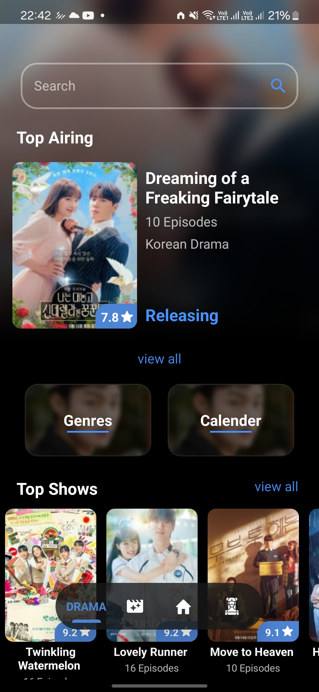 | 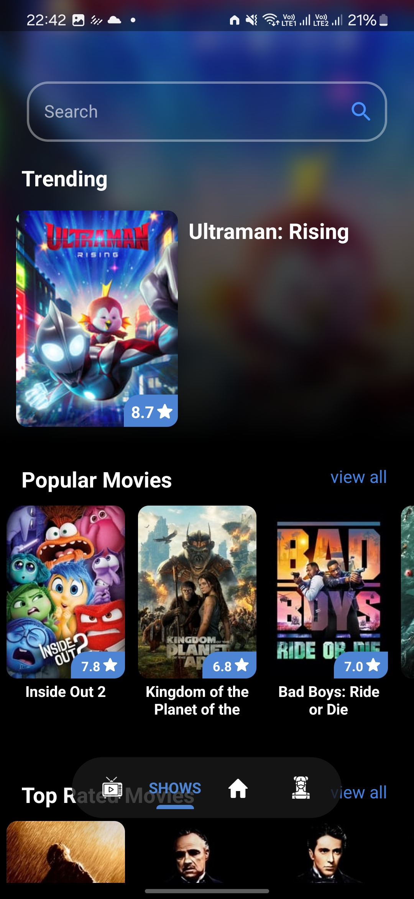 |
| ----------------------------------------------------- | ----------------------------------------------------- |
| 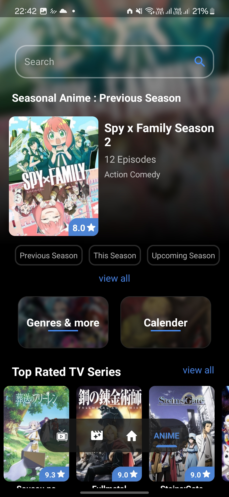 | 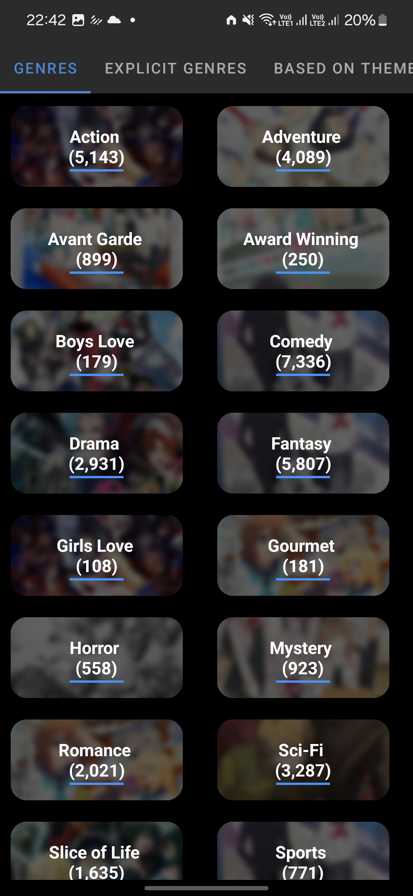 |
| 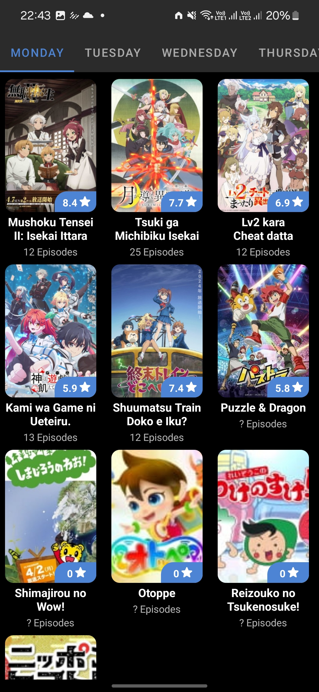 | 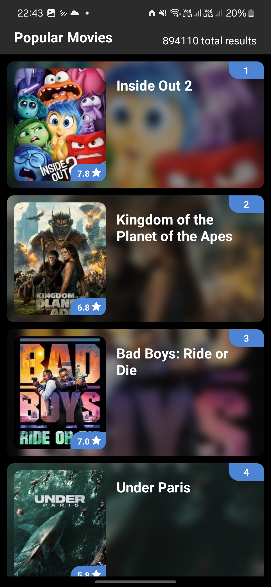 |
| 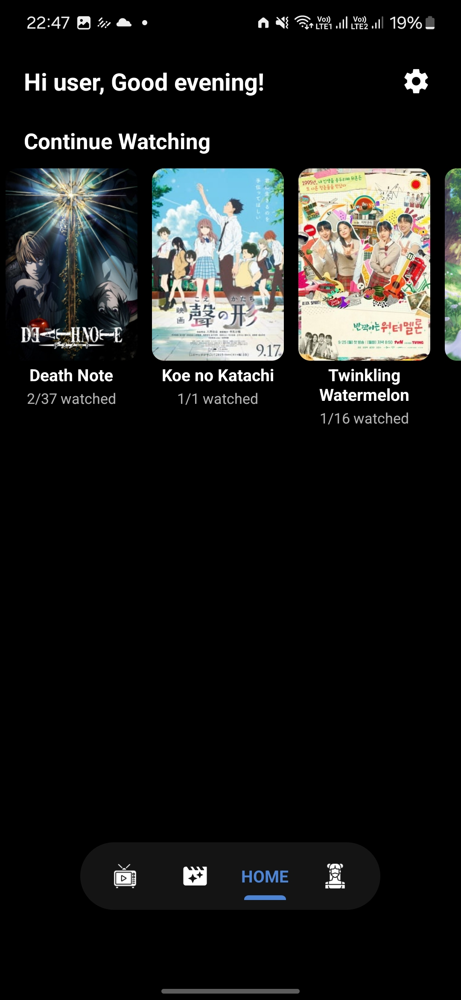 | 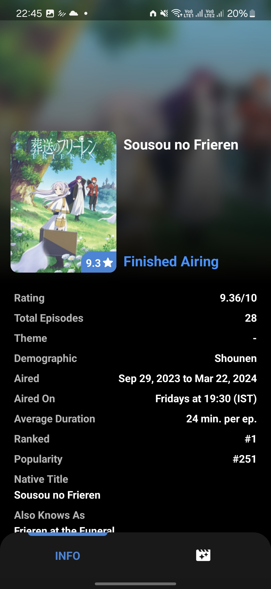 |
| 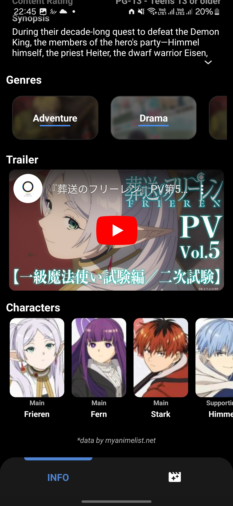 | 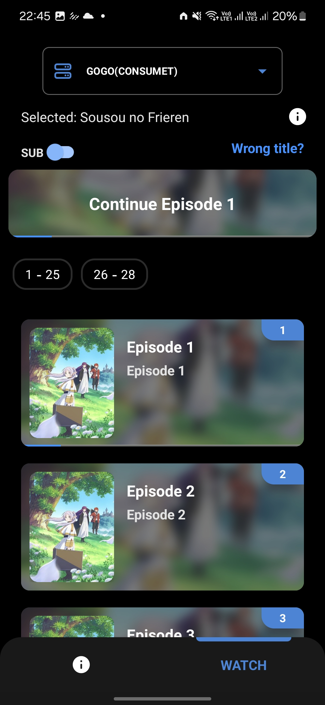 |

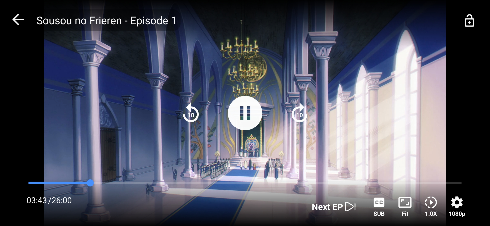

## Release (alpha version)
   - [v1.4.0-Alpha](https://github.com/Debojit-mitra/You-See/releases)

## Dependencies

- Android SDK
- Java Development Kit (JDK)


## Installation

To get a local copy up and running follow these simple steps:

1. **Clone the repo**
   ```sh
   git clone https://github.com/Debojit-mitra/You-See.git

2. **Open with Android Studio**
   - Import the project in Android Studio.
3. **Build and Run**
   - Sync the project with Gradle files and run it on an Android device or emulator.

## Contributing

Contributions are welcome!. The repository is open to contributions, pull requests, and suggestions from the community. Feel free to fork the repo, make improvements, and submit a pull request for review.

## Related repositories
- [api.consumet.org](https://github.com/consumet/api.consumet.org)

## License

This project is licensed under the [MIT License](LICENSE).
